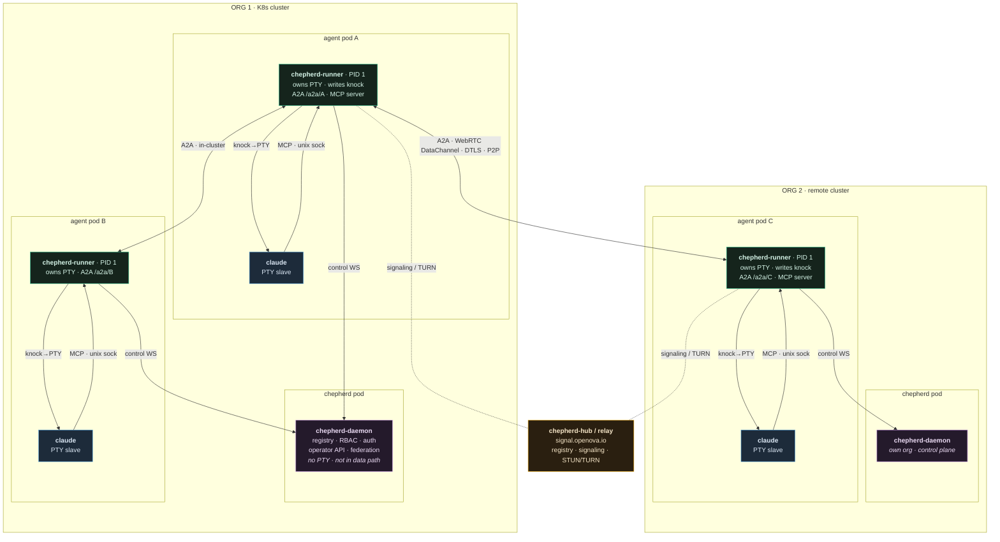
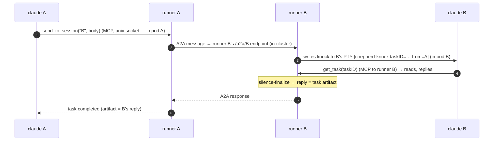
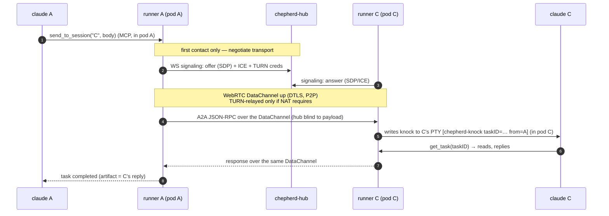

# chepherd A2A — component (deployment) diagram

How an **A2A-unaware agent** (`claude`, codex-cli, aider, …) is wrapped so it can
send and receive A2A (agent-to-agent) messages — within a cluster and across the
internet — under the **agreed Kubernetes model: one runner per agent pod, pods are
independent, nothing is shared across the pod boundary.**

> Source of truth: `docs/V0.9.2-ARCHITECTURE.md`. Per **#3 / #13** the
> **`chepherd-runner` is PID 1 of each agent pod and owns the PTY master FD**; per
> **§ migration line 55** the older *daemon-holds-PTY-master* approach is a
> **deprecated shortcut** being replaced by *runner-owns-PTY (cross-pod safe)*.
> The daemon never reaches into an agent pod's PTY — pods don't share a process or
> tty namespace.
>
> **Bridge vs runner:** they are **one** component in this model. Per line 59 the
> standalone stdio `chepherd-bridge` is folded into the runner — the agent speaks
> MCP directly to its **runner's local MCP server over a unix socket** (#15/#17).
> A separate `chepherd mcp` process exists only in the legacy single-host podman
> shortcut, which also still uses daemon-writes-PTY; that path is mid-migration to
> what is drawn here.

---

## Component map — agents A + B in ORG 1, agent C in a remote ORG 2

Every node is a **process** (or pod). Each agent pod is **independent**: it holds
its own `chepherd-runner` (PID 1) and its `claude` child, connected only by the
pod's own PTY + unix socket. The knock is **always** written by the **local
runner** into its **own** agent's PTY — never across a pod boundary.

---

## What each process is

| Process | Where | Role in A2A |
|---|---|---|
| **claude** (agent) | child inside each agent pod | The A2A-unaware coding agent. Reads its **PTY slave** (sees the knock marker); makes outbound tool calls over MCP to its runner's unix socket. Knows nothing about A2A, pods, or peers. |
| **chepherd-runner** | **PID 1 of each agent pod** | The wrapper. **Owns the PTY master FD** and writes the knock into its own agent's tty; hosts the per-session **A2A endpoint** `/a2a/<sid>` (+ Agent Card); hosts the agent's **MCP server** on a local unix socket; holds the outbound WebSockets (to its daemon, to the hub/relay). |
| **chepherd-daemon** | chepherd pod, one per org | Control plane only: session registry, RBAC, auth/token issuance, operator API + dashboard, federation client. **No PTY, never in the agent data path.** Runners dial out to it over a control WS. |
| **chepherd-hub / relay** | managed, `signal.openova.io` | Remote rendezvous: federation registry + WebRTC **signaling** relay + **STUN/TURN**. Negotiates the P2P channel; never on the data path. |

---

## Real connections (the arrows)

- **claude ↔ runner (in-pod)** — PTY (runner writes the knock to the master FD → agent reads the slave) + a unix-socket **MCP** channel for the agent's outbound `send_to_session` / `get_task` / `list_sessions`. Both are **inside the one pod**.
- **runner → daemon** — outbound control WebSocket: registration, peer discovery, pane stream, command channel, audit upload. Not the A2A data path.
- **runner ↔ runner (in-cluster)** — A2A between two agent pods in the same org; the **receiving** runner writes the knock to **its own** agent's PTY.
- **runner ↔ runner (cross-org)** — A2A over a **WebRTC DataChannel** (DTLS, P2P), negotiated via the hub. Again the receiving runner writes its own agent's knock.
- **runner ↔ hub/relay** — outbound WS for WebRTC **signaling** + TURN fallback. (The daemon also talks to the hub for federation registry/discovery; omitted here to keep the data path clear.)

---

## Message round-trips (process-accurate)

### Local — A → B (two independent pods, same cluster, no hub)

### Remote — A → C (cross-org, over the internet, via the hub)

---

## Invariants

- **Pods are independent — nothing crosses the boundary except the network.** The daemon never touches an agent's PTY; the only thing inside an agent pod that writes the knock is **that pod's own runner**, which owns the PTY master FD (V0.9.2-ARCH #13).
- **The runner is the agent's whole A2A face.** PTY owner (knock in), MCP server (tool calls out), A2A endpoint (peer traffic), outbound WS holder. The agent is just its `claude` child.
- **The daemon is control plane only.** Registry, RBAC, auth, operator API, federation discovery — never in the A2A data path.
- **Zero inbound.** Runners dial *out* to the daemon and to the hub; A2A rides runner→runner (direct in-cluster, or P2P DataChannel across orgs). The hub brokers signaling/TURN and never sees the payload.
- **Legacy note.** The single-host podman dev path still uses the *daemon-holds-PTY* shortcut with a separate `chepherd mcp` stdio bridge; it is being migrated to the runner-owns-PTY model drawn above (V0.9.2-ARCH line 55).
