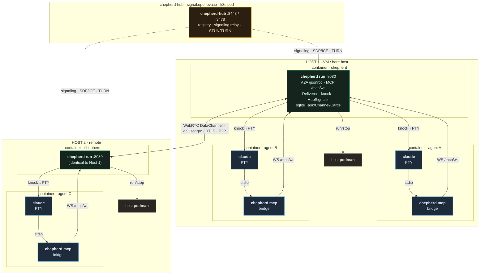
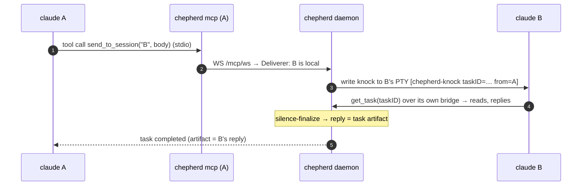

# chepherd A2A — component (deployment) diagram

Every node below is a **literal running process or container** in the shipped
runtime. Every arrow is a **real action** between them (a syscall, a socket, a
wire protocol). Topology: agents **A** and **B** run on **Host 1**, agent **C**
on a remote **Host 2**; A↔B talk on-box, A/B↔C talk over the internet.

> Shipped model = *daemon-spawns-claude-directly*. `cmd/runner` (the per-session
> `/a2a/<sid>` endpoint) is the v0.9.2 future split and is **not** a running
> process today, so it is not drawn. Embedded Gitea (`chepherd-gitea`) is a repo
> sidecar, orthogonal to A2A, omitted.



---

## What each process is

| Process / container | Binary | Role in A2A |
|---|---|---|
| **chepherd** (container, 1 per host) | `chepherd run --headless` | The whole A2A brain: serves A2A `/jsonrpc` + MCP `/mcp/ws`, owns every agent's PTY (writes knocks), runs the Deliverer (path choice) + HubSignaler, holds sqlite Task/Channel/AgentCard state, and spawns agent containers via host podman. |
| **chepherd-agent-…-X** (container, 1 per agent) | `claude` + `chepherd mcp` | The A2A-unaware agent. `claude` (PTY) is the agent; it spawns `chepherd mcp` (the stdio→WS bridge) per `.mcp.json`. Bridge = how the agent *speaks*; the daemon's knock-into-PTY = how it *hears*. |
| **podman** (host daemon, 1 per host) | `podman` | The daemon's hands: creates/stops the sibling agent containers over the bind-mounted socket. |
| **chepherd-hub** (k8s pod, 1 global) | `chepherd-hub` | Remote rendezvous only: peer registry + body-blind WebRTC signaling relay + STUN/TURN. Never on the data path. |

---

## Real connections (the arrows)

- **claude → chepherd mcp** — stdio; claude launches the bridge as its MCP server.
- **chepherd mcp → daemon** — WebSocket `/mcp/ws`; carries the agent's tool calls (`send_to_session`, `get_task`, `list_sessions`). *This is outbound: how the agent acts.*
- **daemon → claude (PTY stdin)** — the daemon writes the one-line knock marker into the agent's terminal. *This is inbound: how a task wakes the agent → it calls `get_task`.*
- **daemon → podman** — `podman run/stop` to spawn/kill agent containers.
- **daemon ⇄ chepherd-hub** — HTTPS, control plane only: register, exchange SDP/ICE, fetch TURN credentials.
- **daemon ⇄ daemon (cross-host)** — the **WebRTC DataChannel** (`dc_jsonrpc`): the A2A JSON-RPC payload, DTLS-encrypted, peer-to-peer. The hub negotiates it but never reads it.

---

## Message round-trips (process-accurate)

### Local — A → B (same host, daemon-internal, no hub, no network)



### Remote — A → C (over the internet, via the hub)

```mermaid
sequenceDiagram
  autonumber
  participant CLA as claude A
  participant D1 as chepherd daemon (Host 1)
  participant H as chepherd-hub
  participant D2 as chepherd daemon (Host 2)
  participant CLC as claude C
  CLA->>D1: send_to_session("C", body) via bridge → Deliverer: C = hub-only
  Note over D1,H: first contact only — negotiate transport
  D1->>H: HTTPS register + /signaling/offer (SDP) + /ice + TURN creds
  D2->>H: long-poll /signaling/pending → offer; POST /signaling/answer
  Note over D1,D2: WebRTC DataChannel up (DTLS, P2P)<br/>TURN-relayed only if NAT requires
  D1->>D2: A2A JSON-RPC over dc_jsonrpc (hub blind to payload)
  D2->>CLC: write knock to C's PTY [chepherd-knock taskID=… from=A]
  CLC->>D2: get_task(taskID) → reads, replies
  D2-->>D1: response over the same DataChannel
  D1-->>CLA: task completed (artifact = C's reply)
```

---

## Invariants

- **The agent is just `claude` in a container.** It speaks via its `chepherd mcp` bridge and hears via knocks the daemon writes to its PTY — it never knows a mesh exists.
- **The daemon is the only A2A-aware process per host.** It hosts the endpoint, owns PTYs, routes, and negotiates remote transport.
- **Zero inbound.** Both daemons dial *out* to the hub; nothing opens an inbound internet port.
- **Hub = control plane only.** Registry + signaling + TURN. The A2A payload rides the P2P DataChannel; the hub cannot read it.
