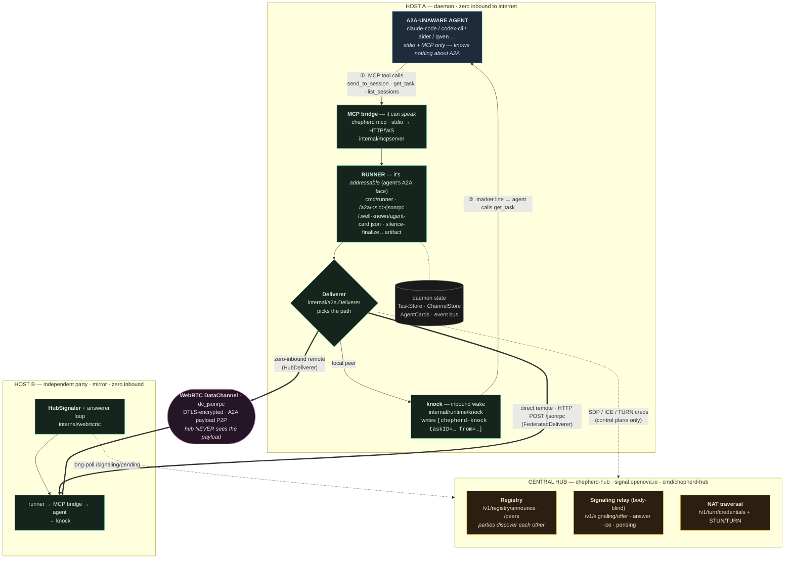
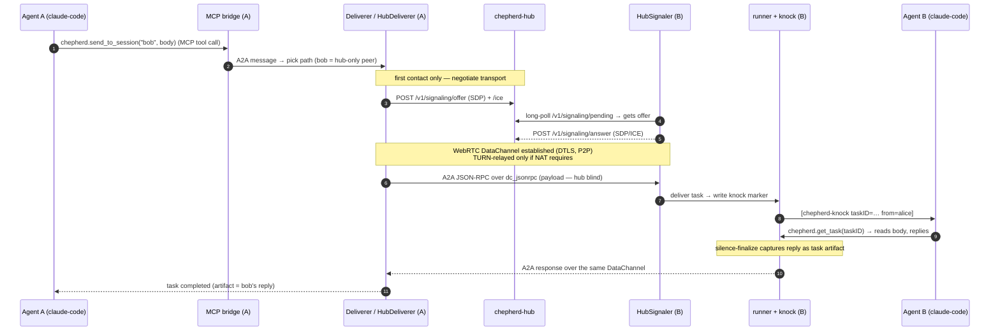

# chepherd A2A architecture — component map

How an **A2A-unaware agent** (claude-code, codex-cli, aider, …) is wrapped so it
can send and receive A2A (agent-to-agent) messages — locally, to a directly
reachable peer, and to a zero-inbound remote party via the central hub.

> Names below are the real code symbols/files. The agent speaks only **stdio +
> MCP**; everything that makes it A2A-capable is chepherd's wrapping.

---

## Component map

---

## Layers, in one line each

| Layer | Component | Role |
|---|---|---|
| **Agent** | claude-code / codex / aider … | A2A-unaware; stdio + MCP only |
| **Speak** | MCP bridge (`chepherd mcp`, `internal/mcpserver`) | agent's stdio MCP → daemon HTTP/WS; carries `send_to_session`, `get_task`, `list_sessions` |
| **Be addressable** | runner (`cmd/runner`) | per-session A2A endpoint `/a2a/<sid>/jsonrpc` + Agent Card; captures the reply as the task artifact |
| **Inbound wake** | knock (`internal/runtime/knock`) | one PTY marker `[chepherd-knock taskID=… from=…]` → agent fetches via `get_task` |
| **Route outbound** | Deliverer (`internal/a2a.Deliverer`) | local→knock · direct→`FederatedDeliverer` · zero-inbound→`HubDeliverer` |
| **Cross-host transport** | `HubSignaler` + WebRTC DataChannel (`dc_jsonrpc`) | encrypted P2P A2A; negotiated via the hub, payload never touches it |
| **Central (remote)** | `chepherd-hub` (`cmd/chepherd-hub`) | registry + body-blind signaling relay + STUN/TURN — control plane only |

---

## Message round-trip (alice → bob, zero-inbound remote)

---

## Invariants worth remembering

- **The agent never knows it's in a mesh.** It calls MCP tools and reads its terminal; the runner + bridge + knock do everything else.
- **Zero inbound on either host.** Both daemons reach *out* to the hub; the hub relays signaling and (if needed) TURN. No daemon opens an inbound port to the internet.
- **The hub is control-plane only.** It brokers discovery + the WebRTC handshake + TURN credentials. The A2A payload rides the DTLS-encrypted DataChannel peer-to-peer — the hub cannot read it.
- **One mental model:** *A2A-unaware agent ↔ MCP bridge (speak) + runner (addressable) → Deliverer picks the path → knock (local) · FederatedDeliverer (direct remote) · HubDeliverer over WebRTC (zero-inbound remote, negotiated via chepherd-hub).*
