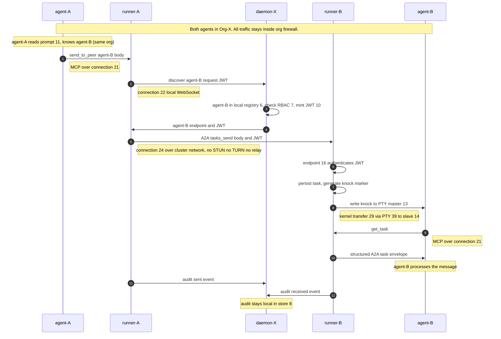
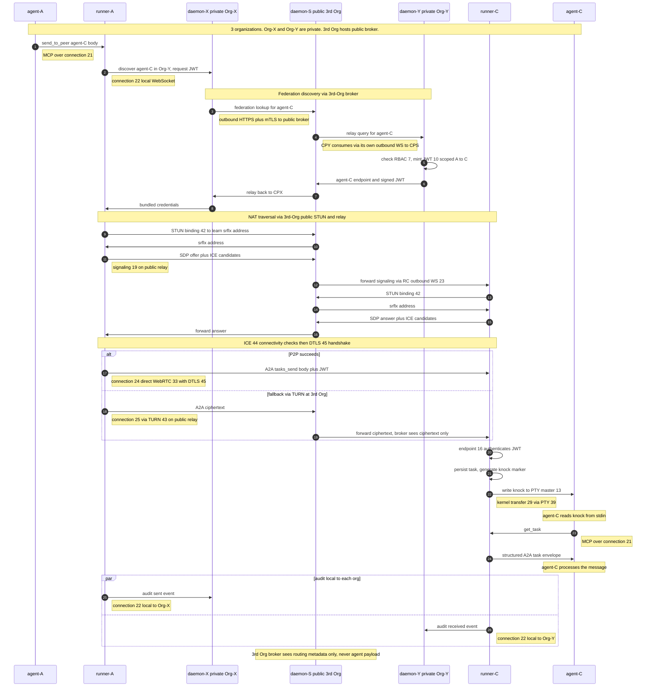
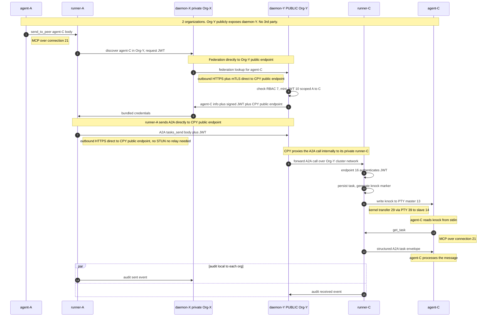

# Chepherd v0.9.1 — Component Inventory + Agent-to-Agent Sequence

**What this is.** Canonical vocabulary for chepherd's v0.9.1 target architecture. Every process, state store, kernel object, network endpoint, connection, wire format, and human role named once with its category, role, location, and relationships. Use these names + numbers for all future architecture discussions.

**Authority.** Authored 2026-05-28 from architect deliberation in [#205](https://github.com/chepherd/chepherd/issues/205) (with parent context in [#186](https://github.com/chepherd/chepherd/issues/186)). Reflects v0.9.1 target shape — legacy items (regex `@-relay`, nested-podman, daemon-holds-PTY-master shortcut, separate internal/external messaging paths) explicitly retired.

---

## What's RETIRED in v0.9.1 (gone, not in the table below)

| Retired thing | Replaced by |
|---|---|
| Regex `@-relay` (`internal/messagebus/relay.go`) | A2A `tasks/send` via runner's A2A server |
| Daemon-holds-PTY-master-FDs shortcut | Runner-owns-PTY-master per pod |
| Nested-podman invention (`--root /var/lib/chepherd-agents/...`) | Standard pod-per-agent (K8s API or sibling podman) |
| `chepherd.send_to_session` as the user-facing tool name | `chepherd.send_to_peer` (unified) |
| Separate MCP path for internal peers + A2A path for external | One A2A path for all inter-agent traffic |
| Optional `chepherd-bridge` (stdio-MCP adapter) | Direct HTTP-MCP from agent to runner's local Unix socket (all target agents support HTTP-MCP) |

---

## Component inventory — 40 components

| # | Name | Category | What it does | Where it lives (logical) | Where it is physically (plain) | Connects to / uses |
|---:|---|---|---|---|---|---|
| 1 | chepherd-daemon | Process | Central service per organization: session registry, RBAC, auth-token issuance, audit aggregator, operator API, dashboard backend | One per organization (typically private behind org firewall; may also be deployed publicly e.g. by OpenOva as a 3rd-party broker) | Either inside the org's private network (default) OR on a public-internet endpoint (deployment choice) | #3 runners (its own org's), #5 browser (its own org's operator), #27 federation peers |
| 2 | chepherd-relay | Process | Public signaling + TURN-fallback service for peer-to-peer rendezvous across NAT | Hosted by an organization that runs publicly (e.g. OpenOva, or any org that exposes itself for federation brokering) | On a public-internet endpoint | Outbound WS from #3 runners and #1 daemons in private orgs that use this broker |
| 3 | chepherd-runner | Process | PID 1 of each agent pod: owns local PTY, hosts MCP + A2A servers, holds outbound WebSockets | Per-agent runtime supervisor | Inside the agent's pod | #4 agent, #1 chepherd-daemon, #2 relay, peer #3 runners |
| 4 | Agent (claude-code / codex / aider / qwen / gemini-cli / opencode) | Process | The actual coding agent (LLM-driven CLI) | Child of runner | Inside the agent's pod (same container as #3, child process) | #3 runner via #21 |
| 5 | Browser dashboard | Process | Web UI for the human operator (one per operator per organization — Org-X's operator-X uses browser-X to drive daemon-X) | Operator's browser tab | On the operator's laptop/desktop browser (private to that operator) | #1 chepherd-daemon of operator's OWN org via #26 |
| 6 | Session registry | State | Map: session-id → reachability (which runner, which relay key) | Inside chepherd-daemon | In the cloud (memory + DB inside chepherd-daemon) | Read/written by #1 |
| 7 | RBAC / policy store | State | Per-pair grants (A may call B?), workspace permissions | Inside chepherd-daemon | In the cloud (DB backing chepherd-daemon) | Read by #1 for auth decisions |
| 8 | Audit log store | State | Append-only log of A2A calls, operator actions, knock injections | Inside chepherd-daemon (or external sink) | In the cloud (PVC or object store backing chepherd-daemon) | Written by #1; uploaded from #3 runners |
| 9 | Agent Card (per session) | State | A2A-spec JSON describing one session's capabilities + endpoint | Per-session metadata | Inside the agent's pod (served by runner at `/a2a/<sid>/.well-known/agent.json`) | Served via #16 to external A2A callers |
| 10 | Short-lived JWT | State | Per-pair scoped, time-limited credential | Issued on demand | Generated in the cloud (by #1), carried in headers across the wire | Issued by #1; carried in #22, #24, #25, #26, #27 |
| 11 | System prompt / team manifest | State | Per-agent initial instructions including peer roster | Loaded by agent at startup | Inside the agent's pod (file in agent's working dir) | Read by #4 on startup |
| 12 | PTY pair | Kernel object | Linux pseudo-terminal pair (master + slave ends) | Connects runner to agent's stdio | In the kernel of the agent pod's host node | Pair of #13 + #14 |
| 13 | PTY master FD | Kernel object | Handle to master end of #12 | Held by runner | In the kernel of the agent pod's host (entry in runner's process FD table) | #12 pair; used by #29 |
| 14 | PTY slave FD | Kernel object | Handle to slave end of #12 | Attached to agent as stdin/stdout/stderr | In the kernel of the agent pod's host (entry in agent's process FD table) | #12 pair; used by #29 |
| 15 | Unix socket (runner local MCP) | Kernel object | AF_UNIX socket for local IPC between agent and runner's MCP server | Local IPC | Inside the agent's pod (path on pod's tmpfs) | Used by #21 |
| 16 | Runner's A2A endpoint (per session) | Endpoint | HTTPS endpoint accepting A2A `tasks/send`, `tasks/get`, etc. | Per-session A2A entry point | Inside the agent's pod (TCP listener in runner) | Receives #24 P2P or #25 relayed traffic; advertised in #9 |
| 17 | Runner's MCP endpoint (per agent) | Endpoint | HTTP MCP server for the agent's outbound tool calls | Per-agent MCP entry point | Inside the agent's pod (bound to #15 unix socket) | Used by #4 via #21 |
| 18 | Chepherd-daemon operator API + dashboard backend | Endpoint | REST + SSE/WebSocket for browser + runner registration + commands | Central public API | In the cloud (TCP listeners in #1, exposed via Ingress/LB) | #22 runner WS, #26 browser, #27 federation |
| 19 | Relay signaling endpoint | Endpoint | WebRTC SDP/ICE rendezvous | P2P handshake server | In the cloud (TCP listener in #2) | Used during #24 handshake via #23 |
| 20 | Relay TURN-fallback endpoint | Endpoint | Opaque-byte forwarding when P2P fails | Fallback data proxy | In the cloud (TCP listener in #2) | Carries #25 traffic |
| 21 | Agent ↔ runner (MCP) | Connection | Agent's outbound MCP tool calls | Local agent→runner channel | Inside the agent's pod (over #15 unix socket) | #4 → #17; uses #30 MCP, #38 AF_UNIX |
| 22 | Runner ↔ chepherd-daemon (control WS) | Connection | Persistent outbound WS for registration, discovery, pane stream out, command channel in, audit upload | Runner's lifeline to central | From inside the agent's pod, outbound to the cloud | #3 → #18; uses #32 WS, #34 HTTPS, #37 JWT |
| 23 | Runner ↔ relay (signaling/fallback WS) | Connection | Persistent outbound WS for signaling + TURN fallback | Runner's P2P enabler | From inside the agent's pod, outbound to the cloud | #3 → #19/#20; uses #32 WS, #34 HTTPS |
| 24 | Runner ↔ runner direct (P2P) | Connection | Peer-to-peer A2A data channel | Direct inter-agent traffic | Between two agent pods (across cluster network or public internet) | #3 ↔ #3; uses #31 A2A, #33 WebRTC, #37 JWT |
| 25 | Runner ↔ runner via relay (fallback) | Connection | Relay-proxied A2A when P2P fails (symmetric NAT, restrictive FW) | Fallback inter-agent traffic | From agent pod → relay (in cloud) → agent pod | #3 → #20 → #3; uses #31 A2A, #32 WS, #37 JWT; relay sees ciphertext only |
| 26 | Browser ↔ chepherd-daemon | Connection | HTTPS + SSE (pane streams) + WS (commands) | Operator's dashboard channel | From operator's laptop browser to the cloud | #5 → #18; uses #32 WS, #34 HTTPS, #35 SSE, #37 JWT |
| 27 | Chepherd-daemon ↔ chepherd-daemon (federation) | Connection | Cross-instance: chepherd-A ↔ chepherd-B | Federation channel | Between two cloud deployments (cross-region or cross-cloud) | #1 ↔ #1'; uses #31 A2A, #34 HTTPS, #36 mTLS |
| 28 | Runner ↔ agent (process spawn) | Connection | Runner forks the agent with PTY slave as stdin/out | Spawn lifecycle | Inside the agent's pod (kernel `fork()` + `dup2()`) | #3 forks #4; uses #39 PTY mechanism |
| 29 | PTY master ↔ slave (kernel buffer) | Connection | Kernel byte transfer between master and slave ends of #12 | Local PTY I/O | In the kernel of the agent pod's host | #13 ↔ #14; uses #39 PTY |
| 30 | MCP | Wire format | Model Context Protocol (JSON-RPC 2.0) — tool call envelope | Agent ↔ chepherd protocol | N/A (wire format spec) | Used by #21 |
| 31 | A2A | Wire format | Agent-to-Agent Protocol (JSON-RPC 2.0) — task delivery envelope | Inter-agent protocol | N/A (wire format spec) | Used by #24, #25, #27 |
| 32 | WebSocket | Wire format | Bidirectional persistent connection (TCP-based, HTTP-upgraded) | Transport for many streams | N/A (wire format spec) | Used by #22, #23, #25, #26 |
| 33 | WebRTC DataChannel | Wire format | Peer-to-peer encrypted data channel (UDP + DTLS; TCP fallback) | P2P transport | N/A (wire format spec) | Used by #24 |
| 34 | HTTPS | Wire format | HTTP/1.1 or HTTP/2 over TLS | REST transport | N/A (wire format spec) | Used by #18, #22, #23, #26, #27 |
| 35 | SSE (Server-Sent Events) | Wire format | One-way server-push event stream over HTTP | Pane stream to browser | N/A (wire format spec) | Used by part of #26 |
| 36 | mTLS (mutual TLS) | Wire format | TLS with bidirectional certificate authentication | Strong cross-trust auth | N/A (wire format spec) | Used by #27 |
| 37 | JWT | Wire format | Short-lived bearer token (JSON Web Token) | Auth claim | N/A (carried in headers across the wire) | Used in headers of #22, #24, #25, #26, #27 |
| 38 | AF_UNIX | Wire format | Local-only socket family | Intra-pod IPC | N/A (wire format spec) | Used by #21 |
| 39 | PTY (Linux pseudo-terminal) | Wire format / kernel mechanism | Kernel terminal-emulation pair | Master/slave duplex for terminal I/O | N/A (kernel mechanism) | Used by #28, #29; instances are #12 |
| 40 | Human operator | Human | Per-organization role: spawns agents, watches panes, sends instructions, grants federation peerings. Each org has its own operator(s) — operator-X in Org-X drives daemon-X; operator-Y in Org-Y drives daemon-Y. Independent humans. | Authority above the system, scoped to their own org | At a physical workstation/laptop inside the org's network | Via #5 browser → #1 chepherd-daemon of their OWN org |
| 41 | STUN service | Endpoint | Helps a NAT-bound runner discover its own public IP:port (server reflexive address) so it can advertise reachable ICE candidates | NAT discovery server | On a public-internet endpoint (typically co-hosted with #2 chepherd-relay by a 3rd-party broker org; may also be a generic public STUN like `stun.l.google.com`) | Queried outbound by #3 runners using #42 STUN during #44 ICE gathering |
| 42 | STUN | Wire format | Session Traversal Utilities for NAT — tiny UDP request/response that returns "your apparent address as I see it" | NAT discovery protocol | N/A (wire format spec, RFC 5389) | Used in queries to #41; also used inside #44 ICE connectivity checks |
| 43 | TURN | Wire format | Traversal Using Relays around NAT — protocol for routing data via a relay when direct P2P fails | Relay-as-last-resort protocol | N/A (wire format spec, RFC 5766/8656) | Used at #20 TURN-fallback endpoint; carries #25 traffic |
| 44 | ICE | Wire format | Interactive Connectivity Establishment — framework that combines local + STUN + TURN candidates, runs connectivity checks, picks the best working path | P2P connection negotiation | N/A (wire format spec, RFC 8445) | Used during #24 setup; relies on #42 STUN and (optionally) #43 TURN |
| 45 | DTLS | Wire format | Datagram Transport Layer Security — encrypts data over UDP (TLS for datagrams). Provides E2E encryption on WebRTC DataChannel | UDP encryption | N/A (wire format spec, RFC 6347) | Used inside #33 WebRTC DataChannel; also keys exchanged via SDP fingerprint during signaling so relay (even in #25 fallback) sees ciphertext only |

> Components 41-45 added 2026-05-28 to make NAT-traversal layers explicit. Numbered after #40 to preserve cross-references already in use; future revisions may regroup if needed.

---

## The three federation patterns — overview

Inter-agent messaging in chepherd follows ONE of three patterns, distinguished by **who runs a publicly-addressable chepherd-daemon** (if any) and **how many organizations are in the picture**:

| # | Pattern | Orgs in scope | Publicly-addressable component |
|---|---|---|---|
| 1 | **Intra-org** (agents in the same org) | 1 | NONE — all traffic stays inside one org's firewall |
| 2 | **Cross-org via 3rd-party public broker** | 3 — Org-X (private) + Org-Y (private) + 3rd Org (publicly hosted, e.g. OpenOva) | 3rd-party org's daemon-S, plus their public STUN + relay services |
| 3 | **Cross-org point-to-point** | 2 — Org-X (private) + Org-Y (one side publicly hosted) | Org-Y's own daemon-Y (Org-Y chose to expose itself; no 3rd party in path) |

In **all patterns**: every chepherd-daemon, runner, and operator-browser can only initiate outbound traffic. The publicly-addressable parts are the only inbound-reachable endpoints. Runners are NEVER directly exposed to the internet — even when their daemon is public (Pattern 3), the daemon acts as the gateway proxy for its runners.

---

## How an agent becomes aware of its peers

Agents don't discover peers spontaneously. **Awareness is seeded by the chepherd-daemon at spawn time** as a field in system prompt 11, derived from session registry 6 and RBAC store 7. Three concrete mechanisms (any combination):

- **Seeded at spawn** (default) — operator spawns the team; daemon writes peer roster into each agent's system prompt 11 before fork
- **Live query** — agent calls `chepherd.list_peers()` MCP tool at runtime; returns current roster from session registry 6
- **Operator instruction** — human types "ask agent-B to review this" into agent-A's pane

In Pattern 1 (intra-org), the daemon writes the local team into the prompt. In Patterns 2 and 3 (cross-org), the operator must have FIRST established a federation peering (operator-X and operator-Y both grant the peering via #7 RBAC), then each side's daemon includes the cross-org peer in the relevant agent's prompt.

---

## Pattern 1 — Intra-org: agent-A messages agent-B (both in Org-X)

### Topology

```
Org-X (private, behind firewall)
operator-X
browser-X
daemon-X
runner-A    runner-B
agent-A     agent-B

No internet. No public components.
```

### Sequence



### Components NOT used in Pattern 1
- chepherd-relay (#2) — no NAT to traverse
- STUN service (#41) — no public address needed
- Federation connection (#27) — no other org involved
- The internet — daemon, runners, agents all on the same private network

---

## Pattern 2 — Cross-org via 3rd-party public broker: agent-A (Org-X) messages agent-C (Org-Y), brokered by 3rd Org

### Topology

```
Org-X (private)              3rd Org (public, e.g. OpenOva)             Org-Y (private)
operator-X                   (no operator, runs public service)         operator-Y
browser-X                                                               browser-Y
daemon-X (private)           daemon-S (PUBLIC endpoint)                 daemon-Y (private)
runners A, B                  + public STUN service                     runner C
                              + public chepherd-relay
                                (signaling + TURN)
     |                              ^   ^                                    |
     | outbound TLS                 |   |                  outbound TLS      |
     +------------------------------+   +------------------------------------+
            (Org-X and Org-Y both trust 3rd Org for federation rendezvous)
```

### Sequence



### Key properties (Pattern 2)
- 3rd-Org broker is involved in: federation directory lookup, daemon-to-daemon brokering, runner-to-runner signaling and TURN fallback
- 3rd-Org broker is NEVER in the plaintext data path (DTLS E2E even in TURN fallback)
- Each org's audit log stays local; 3rd Org has metadata only

---

## Pattern 3 — Cross-org point-to-point: agent-A (Org-X) messages agent-C (Org-Y), Org-Y publicly exposes its own daemon

### Topology

```
Org-X (private)                                  Org-Y (daemon-Y PUBLICLY HOSTED)
operator-X                                       operator-Y
browser-X                                        browser-Y
daemon-X (private)                               daemon-Y (PUBLIC endpoint)
runners A, B                                     runner C (private, behind daemon-Y)
       |                                                 ^
       | outbound HTTPS plus mTLS direct                |
       +--------------------------------------------------+
                  (No 3rd party. daemon-Y is its own broker + runner-gateway)
```

### Sequence



### Key properties (Pattern 3)
- No 3rd party. Org-X must trust Org-Y's public endpoint directly (mTLS pre-arranged certificate exchange)
- daemon-Y plays a dual role: federation endpoint for incoming cross-org calls AND gateway proxy for its own private runners
- Symmetric variant: if BOTH orgs publicly host their daemons, daemon-to-daemon and (optionally) runner-to-runner can also be direct
- Pattern 3 is what OpenOva's public cloud does — OpenOva is "Org-Y" from the perspective of a private org that consumes its service

---

## Invariants across ALL three patterns

- ❌ No regex parsing of agent stdout — agents express intent via MCP tools only
- ❌ No PTY FDs cross pod boundaries — each runner owns its local PTY
- ❌ Daemons hold NO PTY FDs (only runners do)
- ❌ Runners are NEVER directly internet-exposed — they only initiate outbound; daemon-Y or 3rd-Org broker is the public proxy
- ❌ No agent payload EVER in plaintext over the internet — DTLS E2E (Pattern 2 P2P or TURN) or HTTPS-to-trusted-endpoint (Pattern 3)
- ✅ ONE MCP/A2A path for all inter-agent messaging — intra-org and cross-org use the same envelope and tool
- ✅ Each org keeps its own audit log locally (#8); cross-org events have metadata-only at any broker
- ✅ Operator-per-org and browser-per-operator — NO single human can drive across orgs

---

## How to extend this doc

When new architecture is proposed, add components to the table above with the next available #. Each new component must have:
- Distinct name
- One of the 7 categories (or a new category if truly needed)
- One-line role
- Logical + physical location
- Cross-references to other # components

When new flows are designed, draft a sequence diagram in the same Mermaid + ASCII format, referencing the # of every component touched.

The discipline: **no architectural discussion uses an unnamed component.** If a name isn't in the table, it doesn't exist yet.
