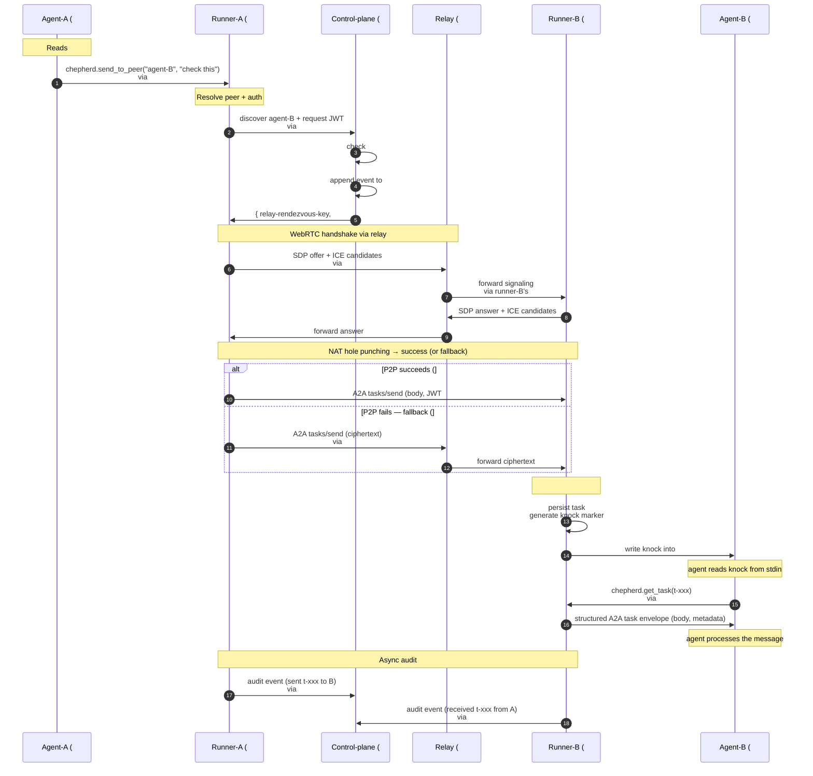

# Chepherd v1.1 — Component Inventory + Agent-to-Agent Sequence

**What this is.** Canonical vocabulary for chepherd's v1.1 target architecture. Every process, state store, kernel object, network endpoint, connection, wire format, and human role named once with its category, role, location, and relationships. Use these names + numbers for all future architecture discussions.

**Authority.** Authored 2026-05-28 from architect deliberation in [#205](https://github.com/chepherd/chepherd/issues/205) (with parent context in [#186](https://github.com/chepherd/chepherd/issues/186)). Reflects v1.1 target shape — legacy items (regex `@-relay`, nested-podman, daemon-holds-PTY-master shortcut, separate internal/external messaging paths) explicitly retired.

---

## What's RETIRED in v1.1 (gone, not in the table below)

| Retired thing | Replaced by |
|---|---|
| Regex `@-relay` (`internal/messagebus/relay.go`) | A2A `tasks/send` via runner's A2A server |
| Daemon-holds-PTY-master-FDs shortcut | Runner-owns-PTY-master per pod |
| Nested-podman invention (`--root /var/lib/chepherd-agents/...`) | Standard pod-per-agent (K8s API or sibling podman) |
| `chepherd.send_to_session` as the user-facing tool name | `chepherd.send_to_peer` (unified) |
| Separate MCP path for internal peers + A2A path for external | One A2A path for all inter-agent traffic |
| Optional `chepherd-bridge` (stdio-MCP adapter) | Direct HTTP-MCP from agent to runner's local Unix socket (all target agents support HTTP-MCP) |

---

## Component inventory — 40 components

| # | Name | Category | What it does | Where it lives (logical) | Where it is physically (plain) | Connects to / uses |
|---:|---|---|---|---|---|---|
| 1 | chepherd-control-plane | Process | Central service: session registry, RBAC, auth-token issuance, audit aggregator, operator API, dashboard backend | Central control-plane deployment (HA-replicated) | In the cloud (publicly addressable server) | #3 runners, #5 browser, #27 federation peers |
| 2 | chepherd-relay | Process | Public signaling + TURN-fallback service for peer-to-peer rendezvous across NAT | Public rendezvous service | In the cloud (publicly addressable server) | #3 runners |
| 3 | chepherd-runner | Process | PID 1 of each agent pod: owns local PTY, hosts MCP + A2A servers, holds outbound WebSockets | Per-agent runtime supervisor | Inside the agent's pod | #4 agent, #1 control-plane, #2 relay, peer #3 runners |
| 4 | Agent (claude-code / codex / aider / qwen / gemini-cli / opencode) | Process | The actual coding agent (LLM-driven CLI) | Child of runner | Inside the agent's pod (same container as #3, child process) | #3 runner via #21 |
| 5 | Browser dashboard | Process | Web UI for the human operator | Operator's browser tab | On the operator's laptop/desktop browser | #1 control-plane via #26 |
| 6 | Session registry | State | Map: session-id → reachability (which runner, which relay key) | Inside control-plane | In the cloud (memory + DB inside control-plane) | Read/written by #1 |
| 7 | RBAC / policy store | State | Per-pair grants (A may call B?), workspace permissions | Inside control-plane | In the cloud (DB backing control-plane) | Read by #1 for auth decisions |
| 8 | Audit log store | State | Append-only log of A2A calls, operator actions, knock injections | Inside control-plane (or external sink) | In the cloud (PVC or object store backing control-plane) | Written by #1; uploaded from #3 runners |
| 9 | Agent Card (per session) | State | A2A-spec JSON describing one session's capabilities + endpoint | Per-session metadata | Inside the agent's pod (served by runner at `/a2a/<sid>/.well-known/agent.json`) | Served via #16 to external A2A callers |
| 10 | Short-lived JWT | State | Per-pair scoped, time-limited credential | Issued on demand | Generated in the cloud (by #1), carried in headers across the wire | Issued by #1; carried in #22, #24, #25, #26, #27 |
| 11 | System prompt / team manifest | State | Per-agent initial instructions including peer roster | Loaded by agent at startup | Inside the agent's pod (file in agent's working dir) | Read by #4 on startup |
| 12 | PTY pair | Kernel object | Linux pseudo-terminal pair (master + slave ends) | Connects runner to agent's stdio | In the kernel of the agent pod's host node | Pair of #13 + #14 |
| 13 | PTY master FD | Kernel object | Handle to master end of #12 | Held by runner | In the kernel of the agent pod's host (entry in runner's process FD table) | #12 pair; used by #29 |
| 14 | PTY slave FD | Kernel object | Handle to slave end of #12 | Attached to agent as stdin/stdout/stderr | In the kernel of the agent pod's host (entry in agent's process FD table) | #12 pair; used by #29 |
| 15 | Unix socket (runner local MCP) | Kernel object | AF_UNIX socket for local IPC between agent and runner's MCP server | Local IPC | Inside the agent's pod (path on pod's tmpfs) | Used by #21 |
| 16 | Runner's A2A endpoint (per session) | Endpoint | HTTPS endpoint accepting A2A `tasks/send`, `tasks/get`, etc. | Per-session A2A entry point | Inside the agent's pod (TCP listener in runner) | Receives #24 P2P or #25 relayed traffic; advertised in #9 |
| 17 | Runner's MCP endpoint (per agent) | Endpoint | HTTP MCP server for the agent's outbound tool calls | Per-agent MCP entry point | Inside the agent's pod (bound to #15 unix socket) | Used by #4 via #21 |
| 18 | Control-plane operator API + dashboard backend | Endpoint | REST + SSE/WebSocket for browser + runner registration + commands | Central public API | In the cloud (TCP listeners in #1, exposed via Ingress/LB) | #22 runner WS, #26 browser, #27 federation |
| 19 | Relay signaling endpoint | Endpoint | WebRTC SDP/ICE rendezvous | P2P handshake server | In the cloud (TCP listener in #2) | Used during #24 handshake via #23 |
| 20 | Relay TURN-fallback endpoint | Endpoint | Opaque-byte forwarding when P2P fails | Fallback data proxy | In the cloud (TCP listener in #2) | Carries #25 traffic |
| 21 | Agent ↔ runner (MCP) | Connection | Agent's outbound MCP tool calls | Local agent→runner channel | Inside the agent's pod (over #15 unix socket) | #4 → #17; uses #30 MCP, #38 AF_UNIX |
| 22 | Runner ↔ control-plane (control WS) | Connection | Persistent outbound WS for registration, discovery, pane stream out, command channel in, audit upload | Runner's lifeline to central | From inside the agent's pod, outbound to the cloud | #3 → #18; uses #32 WS, #34 HTTPS, #37 JWT |
| 23 | Runner ↔ relay (signaling/fallback WS) | Connection | Persistent outbound WS for signaling + TURN fallback | Runner's P2P enabler | From inside the agent's pod, outbound to the cloud | #3 → #19/#20; uses #32 WS, #34 HTTPS |
| 24 | Runner ↔ runner direct (P2P) | Connection | Peer-to-peer A2A data channel | Direct inter-agent traffic | Between two agent pods (across cluster network or public internet) | #3 ↔ #3; uses #31 A2A, #33 WebRTC, #37 JWT |
| 25 | Runner ↔ runner via relay (fallback) | Connection | Relay-proxied A2A when P2P fails (symmetric NAT, restrictive FW) | Fallback inter-agent traffic | From agent pod → relay (in cloud) → agent pod | #3 → #20 → #3; uses #31 A2A, #32 WS, #37 JWT; relay sees ciphertext only |
| 26 | Browser ↔ control-plane | Connection | HTTPS + SSE (pane streams) + WS (commands) | Operator's dashboard channel | From operator's laptop browser to the cloud | #5 → #18; uses #32 WS, #34 HTTPS, #35 SSE, #37 JWT |
| 27 | Control-plane ↔ control-plane (federation) | Connection | Cross-instance: chepherd-A ↔ chepherd-B | Federation channel | Between two cloud deployments (cross-region or cross-cloud) | #1 ↔ #1'; uses #31 A2A, #34 HTTPS, #36 mTLS |
| 28 | Runner ↔ agent (process spawn) | Connection | Runner forks the agent with PTY slave as stdin/out | Spawn lifecycle | Inside the agent's pod (kernel `fork()` + `dup2()`) | #3 forks #4; uses #39 PTY mechanism |
| 29 | PTY master ↔ slave (kernel buffer) | Connection | Kernel byte transfer between master and slave ends of #12 | Local PTY I/O | In the kernel of the agent pod's host | #13 ↔ #14; uses #39 PTY |
| 30 | MCP | Wire format | Model Context Protocol (JSON-RPC 2.0) — tool call envelope | Agent ↔ chepherd protocol | N/A (wire format spec) | Used by #21 |
| 31 | A2A | Wire format | Agent-to-Agent Protocol (JSON-RPC 2.0) — task delivery envelope | Inter-agent protocol | N/A (wire format spec) | Used by #24, #25, #27 |
| 32 | WebSocket | Wire format | Bidirectional persistent connection (TCP-based, HTTP-upgraded) | Transport for many streams | N/A (wire format spec) | Used by #22, #23, #25, #26 |
| 33 | WebRTC DataChannel | Wire format | Peer-to-peer encrypted data channel (UDP + DTLS; TCP fallback) | P2P transport | N/A (wire format spec) | Used by #24 |
| 34 | HTTPS | Wire format | HTTP/1.1 or HTTP/2 over TLS | REST transport | N/A (wire format spec) | Used by #18, #22, #23, #26, #27 |
| 35 | SSE (Server-Sent Events) | Wire format | One-way server-push event stream over HTTP | Pane stream to browser | N/A (wire format spec) | Used by part of #26 |
| 36 | mTLS (mutual TLS) | Wire format | TLS with bidirectional certificate authentication | Strong cross-trust auth | N/A (wire format spec) | Used by #27 |
| 37 | JWT | Wire format | Short-lived bearer token (JSON Web Token) | Auth claim | N/A (carried in headers across the wire) | Used in headers of #22, #24, #25, #26, #27 |
| 38 | AF_UNIX | Wire format | Local-only socket family | Intra-pod IPC | N/A (wire format spec) | Used by #21 |
| 39 | PTY (Linux pseudo-terminal) | Wire format / kernel mechanism | Kernel terminal-emulation pair | Master/slave duplex for terminal I/O | N/A (kernel mechanism) | Used by #28, #29; instances are #12 |
| 40 | Human operator | Human | Spawns agents, watches panes, sends instructions, grants federation peerings | Authority above the system | At a physical workstation/laptop | Via #5 browser → #1 control-plane |

---

## Sequence — agent-A messages agent-B (worldwide federation case)

Both agents are behind firewalls in different orgs. Both pods can only initiate outbound connections. This sequence exercises every relevant component from the table above.

### Preconditions

- Both agents already spawned by #40 operator via #5 browser → #18 → #1 (writes to #6 session registry).
- Both #3 runners started, each forked its #4 agent via #28 with #14 PTY slave attached.
- Each runner already holds:
  - Persistent #22 control WS to #1 control-plane (registration, audit upload, command channel)
  - Persistent #23 relay WS to #2 chepherd-relay (for future signaling + TURN fallback)
  - Each #4 agent has #11 system prompt naming its peers.
  - Each #9 Agent Card is published at runner's #16 A2A endpoint.

### Mermaid sequence diagram



### ASCII fallback (terminal-readable)

```
Agent-A(#4)   Runner-A(#3)   Control-plane(#1)   Relay(#2)   Runner-B(#3)   Agent-B(#4)
    │              │                │                │              │              │
    │ system prompt #11 lists agent-B; decide to message            │              │
    │              │                │                │              │              │
 1. │ chepherd.send_to_peer("agent-B", "check this")                │              │
    │ #21 via #15 unix socket; #30 MCP                              │              │
    ├─────────────►│                │                │              │              │
    │              │                │                │              │              │
 2. │              │ discover agent-B + request JWT                 │              │
    │              │ #22 control WS; #32 WebSocket, #34 HTTPS       │              │
    │              ├───────────────►│                │              │              │
    │              │                │ check #7 RBAC  │              │              │
    │              │                │ mint #10 JWT   │              │              │
    │              │                │ append #8 audit│              │              │
    │              │◄───────────────┤                │              │              │
    │              │ { relay key, JWT }              │              │              │
    │              │                │                │              │              │
 3. │              │ WebRTC SDP offer + ICE          │              │              │
    │              │ #23 to #19 signaling                           │              │
    │              ├────────────────────────────────►│              │              │
    │              │                │                ├─────────────►│              │
    │              │                │                │ forward to runner-B         │
    │              │                │                │              │              │
    │              │                │                │◄─────────────┤              │
    │              │                │                │ SDP answer + ICE            │
    │              │◄───────────────────────────────-┤              │              │
    │              │                │                │              │              │
 4. │              │ Try NAT hole punching → DataChannel established │             │
    │              │ #24 P2P (or #25 relay fallback)                │              │
    │              │                                                │              │
 5. │              │ A2A tasks/send                                 │              │
    │              │ #31 A2A over #33 WebRTC, #37 JWT in header     │              │
    │              ├═══════════════════════════════════════════════►│              │
    │              │                                                │              │
 6. │              │                                                │ #16 endpoint │
    │              │                                                │ auth JWT     │
    │              │                                                │ persist task │
    │              │                                                │              │
 7. │              │                                                │ write knock  │
    │              │                                                │ to #13 PTY   │
    │              │                                                │ master       │
    │              │                                                │ #29 kernel   │
    │              │                                                │ transfer     │
    │              │                                                │ #14 slave    │
    │              │                                                ├─────────────►│
    │              │                                                │              │
 8. │              │                                                │ chepherd.    │
    │              │                                                │ get_task     │
    │              │                                                │◄─────────────┤
    │              │                                                │ #21 / #30 MCP│
    │              │                                                │              │
    │              │                                                │ structured   │
    │              │                                                │ A2A envelope │
    │              │                                                ├─────────────►│
    │              │                                                │              │
    │              │                                                │ agent processes
    │              │                                                │              │
 9. │              │ async audit upload                             │              │
    │              ├───────────────►│                │              │              │
    │              │                │                │              │              │
    │              │                │                │ async audit from runner-B   │
    │              │                │◄───────────────────────────---┤              │
```

### Step-by-step (numbered for cross-reference with diagram)

1. **Agent-A initiates** — agent-A reads its #11 system prompt knowing agent-B exists, calls `chepherd.send_to_peer("agent-B", "check this")` MCP tool via #21 (over #15 unix socket, using #30 MCP / #38 AF_UNIX).

2. **Discovery + auth** — runner-A queries #1 control-plane via #22 control WS. Control-plane checks #7 RBAC store, mints a short-lived #10 JWT scoped (A→B, 60s TTL), records event in #8 audit log, returns the relay rendezvous key + JWT to runner-A.

3. **Signaling** — runner-A sends WebRTC SDP offer + ICE candidates via #23 to #19 (relay's signaling endpoint). Relay forwards to runner-B via runner-B's #23. Runner-B responds with SDP answer + ICE candidates; relay shuttles back to runner-A.

4. **Channel establishment** — both runners attempt NAT hole punching. Success → #24 direct WebRTC DataChannel. Failure → #25 relay-tunneled fallback via #20 TURN endpoint (relay sees ciphertext only).

5. **A2A tasks/send** — runner-A constructs A2A `tasks/send` envelope, includes #10 JWT in auth header, sends over #24 (or #25). Uses #31 A2A over #33 WebRTC.

6. **A2A endpoint receives** — runner-B's #16 A2A endpoint authenticates the #10 JWT, persists the task locally.

7. **Knock injection** — runner-B writes knock marker (`<<CHEPHERD-MSG task=t-xxx from=agent-A>>`) to its locally-held #13 PTY master FD. Kernel transfers bytes via #29 to #14 PTY slave FD → agent-B's stdin.

8. **Structured fetch** — agent-B reads the knock from stdin, calls `chepherd.get_task(t-xxx)` via #21 / #30 MCP. Runner-B's #17 MCP endpoint returns the full A2A task envelope (body, metadata, attachments). Agent-B processes.

9. **Async audit** — both runners send audit events (sent/received) to #1 via their respective #22 control WS connections. Stored in #8.

### What did NOT happen in this flow

- ❌ No regex parsing of any stdout (no `@-relay`)
- ❌ No PTY FDs traversed pod boundaries (each runner holds its own)
- ❌ No daemon-side PTY ownership (#1 holds no FDs)
- ❌ No agent-payload data ever flowed through #1 control-plane
- ❌ No agent-payload data ever flowed through #2 relay in plain text (DTLS / TLS end-to-end)
- ❌ No separate MCP path for "internal" vs A2A for "external" — same A2A wire for both
- ❌ No `chepherd-bridge` stdio adapter — agent talks HTTP-MCP to runner directly via #15

### Same flow, simpler cases

- **Same chepherd, same cluster, two pods**: skip step 3 (signaling) — runner-A directly opens #24 to runner-B's #16 over cluster network. Steps 5-9 identical.
- **Same chepherd, same pod (artificial example)**: collapses to function-call equivalent of #24 inside one runner. Same envelope shape, same audit, same get_task pattern.
- **Cross-org federation between chepherd instances**: steps 3-5 happen between chepherd-A's #1 and chepherd-B's #1 via #27 (mTLS), then chepherd-B's #1 routes inward to its runner-B exactly like steps 6-9.

---

## How to extend this doc

When new architecture is proposed, add components to the table above with the next available #. Each new component must have:
- Distinct name
- One of the 7 categories (or a new category if truly needed)
- One-line role
- Logical + physical location
- Cross-references to other # components

When new flows are designed, draft a sequence diagram in the same Mermaid + ASCII format, referencing the # of every component touched.

The discipline: **no architectural discussion uses an unnamed component.** If a name isn't in the table, it doesn't exist yet.
